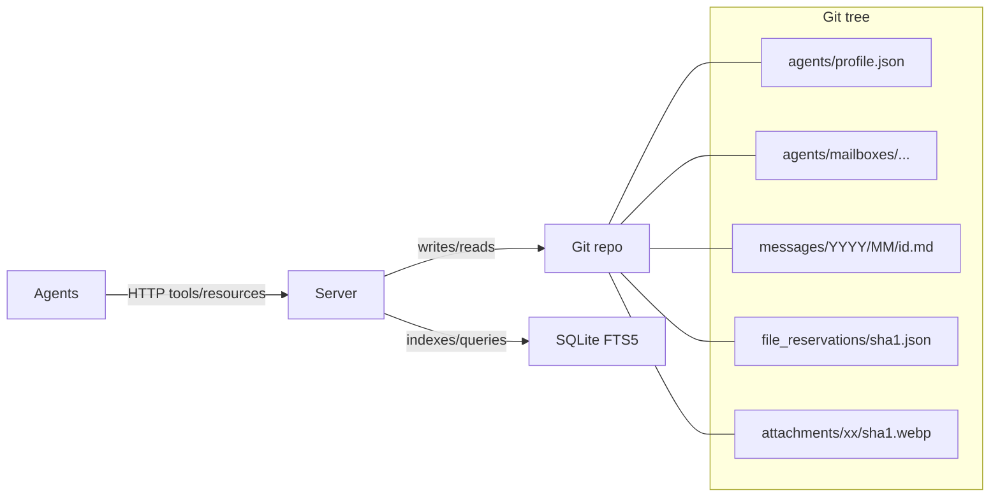

# MCP Agent Mail

> "It's like gmail for your coding agents!"

## Overview

MCP Agent Mail is a mail-like coordination layer for coding agents, exposed as an HTTP-only FastMCP server. It gives agents memorable identities, an inbox/outbox, searchable message history, and voluntary file reservation "leases" to avoid stepping on each other.

Think of it as asynchronous email + directory + change-intent signaling for your agents, backed by Git (for human-auditable artifacts) and SQLite (for indexing and queries).

### Why This Exists

Modern projects often run multiple coding agents at once (backend, frontend, scripts, infra). Without a shared coordination fabric, agents:

- Overwrite each other's edits or panic on unexpected diffs
- Miss critical context from parallel workstreams
- Require humans to "liaison" messages across tools and teams

This project provides a lightweight, interoperable layer so agents can:

- Register a temporary-but-persistent identity (e.g., GreenCastle)
- Send/receive GitHub-Flavored Markdown messages with images
- Search, summarize, and thread conversations
- Declare advisory file reservations (leases) on files/globs to signal intent
- Inspect a directory of active agents, programs/models, and activity

## Core Components

### Post Office Protocol
Provides asynchronous messaging between agents:
- **Send messages**: Agents post messages to other agents' mailboxes
- **Read messages**: Agents poll their mailbox for new messages
- **Non-blocking**: Sender doesn't wait for receiver to be online
- **Threaded conversations**: Group related messages by `thread_id`

### File Lease System (Mutex Locking)
Critical for preventing race conditions when multiple agents edit shared files:
- **Acquire lease**: Agent requests exclusive access to a file/glob pattern
- **Hold lease**: Agent has exclusive write access
- **Release lease**: Agent releases file for others to use
- **Timeout protection**: Leases automatically expire to prevent deadlocks
- **Pre-commit guard**: Optional hook that blocks commits conflicting with active leases

### Agent Directory
LDAP-style queries for discovering active agents:
- Memorable adjective+noun identities (e.g., "GreenCastle", "BluePhoenix")
- Registration with program/model metadata
- Activity tracking and presence info

## Installation

### One-Line Installer

```bash
curl -fsSL "https://raw.githubusercontent.com/Dicklesworthstone/mcp_agent_mail/main/scripts/install.sh?$(date +%s)" | bash -s -- --yes
```

What this does:
- Installs `uv` if missing and updates your PATH
- Installs `jq` (needed for safe config merging)
- Creates a Python 3.14 virtual environment with dependencies
- Auto-detects and integrates with supported agent tools (Claude Code, Codex, etc.)
- Starts the MCP HTTP server on port 8765
- Creates helper scripts under `scripts/`
- Adds an `am` shell alias for quick server startup
- Installs/wires Beads `bd` CLI and Beads Viewer `bv` TUI (optional, pass `--skip-beads` or `--skip-bv` to opt out)

### Starting the Server

After installation, start the server from anywhere:

```bash
am
```

The `am` alias automatically:
1. Changes to the MCP Agent Mail directory
2. Runs the server startup script
3. Loads your bearer token from `.env`
4. Starts the HTTP server

**Port conflicts?** Use `--port` flag:

```bash
curl -fsSL "..." | bash -s -- --port 9000 --yes

# Or reconfigure after installation:
uv run python -m mcp_agent_mail.cli config set-port 9000
```

### Manual Setup

```bash
# Install uv
curl -LsSf https://astral.sh/uv/install.sh | sh
export PATH="$HOME/.local/bin:$PATH"

# Clone and setup
git clone https://github.com/Dicklesworthstone/mcp_agent_mail
cd mcp_agent_mail
uv python install 3.14
uv venv -p 3.14
source .venv/bin/activate
uv sync

# Detect agents and start server
scripts/automatically_detect_all_installed_coding_agents_and_install_mcp_agent_mail_in_all.sh

# Later, restart server
scripts/run_server_with_token.sh
```

## Usage Patterns

### 1. Same Repository Coordination

```python
# Register identity
ensure_project(project_key="/abs/path/to/repo")
register_agent(project_key, agent_name="GreenCastle")

# Reserve files before editing
file_reservation_paths(
    project_key=project_key,
    agent_name="GreenCastle",
    paths=["src/**"],
    ttl_seconds=3600,
    exclusive=True
)

# Send threaded messages
send_message(
    project_key=project_key,
    from_agent="GreenCastle",
    to_agent="BluePhoenix",
    subject="API refactor coordination",
    thread_id="FEAT-123",
    body="Starting work on API endpoints..."
)

# Check inbox
fetch_inbox(project_key=project_key, agent_name="GreenCastle")

# Acknowledge messages
acknowledge_message(project_key=project_key, agent_name="GreenCastle", message_id="...")

# Release reservation when done
release_file_reservations(project_key=project_key, agent_name="GreenCastle", paths=["src/**"])
```

### 2. Cross-Repository Coordination

For projects with multiple repos (e.g., Next.js frontend + FastAPI backend):

**Option A: Single Project Bus**
- Register both sides under the same `project_key` (shared path)
- Use specific reservation patterns: `frontend/**` vs `backend/**`

**Option B: Separate Projects**
- Each repo has its own `project_key`
- Use `macro_contact_handshake` or `request_contact`/`respond_contact` to link agents
- Keep shared `thread_id` (e.g., ticket key) for clean audit trails

## Resource Layer (Fast Reads)

Convenient read-only access without tool calls:

```
resource://inbox/{AgentName}?project=<abs-path>&limit=20
resource://thread/{ThreadID}?project=<abs-path>&include_bodies=true
resource://directory?project=<abs-path>
resource://reservations?project=<abs-path>
```

## Macros vs Granular Tools

**Prefer macros** for speed or smaller models:
- `macro_start_session` - Register and initialize
- `macro_prepare_thread` - Setup conversation
- `macro_file_reservation_cycle` - Reserve → work → release
- `macro_contact_handshake` - Cross-project agent linking

**Use granular tools** for control:
- `register_agent`, `send_message`, `fetch_inbox`
- `file_reservation_paths`, `release_file_reservations`
- `acknowledge_message`, `search_messages`

## Integrating with Beads

Beads is a lightweight, dependency-aware task planner (`bd` CLI) that complements Agent Mail:

- **Beads**: Owns task prioritization, status, dependencies
- **Agent Mail**: Handles messaging, file reservations, audit trails
- **Shared identifiers**: Use Beads issue ID (e.g., `bd-123`) as Mail `thread_id`

### Recommended Conventions

- **Single source of truth**: Use Beads for task status; use Agent Mail for conversation/decisions
- **Shared IDs**: Beads `bd-###` = Mail `thread_id`
- **Subjects**: Prefix messages with `[bd-123]`
- **Reservations**: Include issue ID in `reason` field

### Typical Agent Flow

```bash
# 1. Pick ready work (Beads)
bd ready --json  # Choose highest priority, no blockers

# 2. Reserve edit surface (Mail)
file_reservation_paths(project_key, agent_name, ["src/**"],
                       ttl_seconds=3600, exclusive=True, reason="bd-123")

# 3. Announce start (Mail)
send_message(..., thread_id="bd-123", subject="[bd-123] Starting feature X")

# 4. Work and update (Mail)
# Reply in-thread with progress, attach artifacts/images

# 5. Complete and release
bd close bd-123 --reason "Completed"
release_file_reservations(project_key, agent_name, paths=["src/**"])
# Final Mail reply: "[bd-123] Completed" with summary
```

### Mapping Cheat-Sheet

| Beads | Agent Mail |
|-------|------------|
| `bd-###` issue ID | `thread_id` |
| Issue status | Not tracked (Beads is authority) |
| File paths in issue | Reservation `paths` + `reason="bd-###"` |
| Priority/blocking | Not tracked (query `bd ready`) |

## Beads Viewer (bv) - AI-Friendly Task Analysis

The Beads Viewer (`bv`) provides **precomputed graph analytics** for intelligent task selection:

### Robot Flags for AI Integration

| Flag | Output | Agent Use Case |
|------|--------|----------------|
| `bv --robot-help` | All AI-facing commands | Discovery / capability check |
| `bv --robot-insights` | PageRank, betweenness, critical path, cycles | "What's most impactful?" |
| `bv --robot-plan` | Parallel tracks, unblocks lists | "What can run in parallel?" |
| `bv --robot-priority` | Priority recommendations with reasoning | "What should I work on next?" |
| `bv --robot-recipes` | Available filter presets | "Show me ready work" |
| `bv --robot-diff --diff-since <ref>` | Changes since commit/date | "What changed?" |

### Example: Agent Task Selection

```bash
# 1. Get priority recommendations
bv --robot-priority
# Returns JSON with ranked tasks, impact scores, confidence

# 2. Check what completing a task would unblock
bv --robot-plan
# Returns parallel tracks with dependency chains

# 3. After work, check what changed
bv --robot-diff --diff-since "1 hour ago"
# Returns new items, closed items, cycle changes
```

### When to Use bv vs bd

| Tool | Best For |
|------|----------|
| `bd` | Creating, updating, closing tasks; `bd ready` for "what's next" |
| `bv` | Graph analysis, impact assessment, parallel planning, change tracking |

**Rule of thumb**: Use `bd` for task operations, use `bv` for task intelligence.

### Agent Mail + Beads Viewer Integration

Combine bv insights with Agent Mail coordination:

1. **Agent A** runs `bv --robot-priority` → identifies `bd-42` as highest-impact
2. **Agent A** reserves files: `file_reservation_paths(..., reason="bd-42")`
3. **Agent A** announces: `send_message(..., thread_id="bd-42", subject="[bd-42] Starting high-impact refactor")`
4. **Other agents** see reservation and Mail announcement, pick different tasks
5. **Agent A** completes, runs `bv --robot-diff` to report downstream unblocks

## Architecture



### Dual Persistence Model

- **Git**: Human-readable markdown for every canonical message and per-recipient inbox/outbox copy
- **SQLite with FTS5**: Fast search, directory queries, file reservation tracking

## Use Cases

### Multi-Agent Coordination
When multiple agents (e.g., "Polecats" in Gas Town architecture) work in parallel:
- Prevents simultaneous edits to the same file
- Enables message passing for task coordination
- Reduces merge conflicts in Git

### Swarm Development
For parallel worktree setups where multiple agents run simultaneously:
- File leases prevent write conflicts
- Asynchronous messages enable work orchestration
- Agents can request help or signal completion

### Cross-Service Refactoring
- Multiple agents splitting a large refactor across services while staying in sync
- Frontend and backend teams coordinating thread-by-thread
- Protecting critical migrations with exclusive file reservations

### Technical Discussion Archive
- Searching and summarizing long technical discussions as threads evolve
- Audit trail of decisions with human-readable Git history
- Attachment support for diagrams, screenshots, logs

## Common Pitfalls

- **"from_agent not registered"**: Always `register_agent` in the correct `project_key` first
- **"FILE_RESERVATION_CONFLICT"**: Adjust patterns, wait for expiry, or use non-exclusive reservation
- **Auth errors**: If JWT+JWKS is enabled, include bearer token with matching `kid`; static bearer used only when JWT disabled
- **ID drift**: Always include `bd-###` in Mail `thread_id` to keep tools aligned

## Additional Resources

**Repository**: [github.com/Dicklesworthstone/mcp_agent_mail](https://github.com/Dicklesworthstone/mcp_agent_mail)

**Related Projects**:
- [Beads](https://github.com/steveyegge/beads) - Git-backed task planner
- [Beads Viewer](https://github.com/Dicklesworthstone/beads_viewer) - TUI with AI-friendly robot flags

**Documentation**:
- `project_idea_and_guide.md` - Full design specification
- Web UI at `/mail` path (human-facing mail viewer)
- CLI: `uv run python -m mcp_agent_mail.cli --help`

## CLI Commands

```bash
# Configuration
uv run python -m mcp_agent_mail.cli config set-port 9000
uv run python -m mcp_agent_mail.cli config show

# Insert blurbs into AGENTS.md/CLAUDE.md
uv run python -m mcp_agent_mail.cli docs insert-blurbs

# Server management
scripts/run_server_with_token.sh
am  # Start with alias (after installation)
```

## Technical Value for Agents

- **Asynchronous coordination**: Post Office pattern for non-blocking communication
- **Race condition prevention**: File Lease system with mutex locking and pre-commit guards
- **Audit trail**: Git-backed markdown messages for human review
- **Fast queries**: SQLite FTS5 for search, directory lookups, reservation checks
- **Graph intelligence**: Integration with Beads Viewer for impact analysis
- **Resource layer**: Convenient read-only access without tool calls
- **Multi-model support**: Works with Claude Code, Codex, Gemini CLI, and other MCP clients
