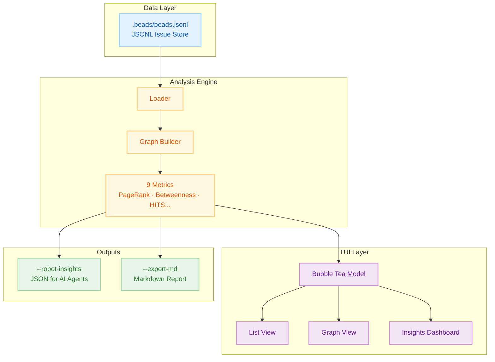

# Beads Viewer (bv)

> **The elegant, keyboard-driven terminal interface for the [Beads](https://github.com/steveyegge/beads) issue tracker.**

## Overview

`bv` is a high-performance **Terminal User Interface (TUI)** for browsing and managing tasks in projects that use the Beads issue tracking system. It provides graph analytics capabilities to help agents identify critical path bottlenecks and prioritize work based on dependency analysis.

### Why You'd Care

- **Speed**: Browse thousands of issues instantly with zero network latency
- **Focus**: Stay in your terminal with Vim-style navigation (`j`/`k`)
- **Intelligence**: Visualizes projects as dependency graphs, automatically highlighting bottlenecks, cycles, and critical paths
- **AI-Ready**: Provides structured, pre-computed insights for AI coding agents via robot flags

## Quick Install

### Linux/macOS

```bash
curl -fsSL "https://raw.githubusercontent.com/Dicklesworthstone/beads_viewer/main/install.sh?$(date +%s)" | bash
```

### Windows (PowerShell)

```powershell
irm "https://raw.githubusercontent.com/Dicklesworthstone/beads_viewer/main/install.ps1" | iex
```

> **Note:** Windows requires Go 1.21+ ([download](https://go.dev/dl/)). For best display, use Windows Terminal with a [Nerd Font](https://www.nerdfonts.com/).

## The Core Experience

### Fast, Fluid Browsing

No web page loads, no heavy clients. `bv` starts instantly:

- **Split-View Dashboard**: List on left, full details on right (wide screens)
- **Markdown Rendering**: Descriptions, comments, and notes beautifully rendered with syntax highlighting
- **Instant Filtering**: Zero-latency filtering - press `o` for Open, `c` for Closed, `r` for Ready (unblocked)
- **Live Reload**: Watches `.beads/beads.jsonl` and refreshes automatically when file changes

### Rich Context

- **Comments & History**: Scroll through full conversation history
- **Metadata**: Assignees, Labels, Priority badges, creation dates
- **Search**: Powerful fuzzy search (`/`) finds issues by ID, title, or content instantly

### Focused Workflows

- **Kanban Board** (`b`): Columnar view (Open, In Progress, Blocked, Closed)
- **Visual Graph** (`g`): Explore the dependency tree visually
- **Insights** (`i`): See graph metrics and bottlenecks
- **History View** (`h`): Timeline of changes, correlating git commits with bead modifications
- **Ultra-Wide Mode**: On large monitors, list expands with extra columns like sparklines and label tags

### Quick Actions

- **Export** (`E`): Export all issues to timestamped Markdown file with Mermaid diagrams
- **Graph Export**: `bv --robot-graph` outputs dependency graph as JSON, DOT (Graphviz), or Mermaid
- **Copy** (`C`): Copy selected issue as formatted Markdown to clipboard
- **Edit** (`O`): Open `.beads/beads.jsonl` file in preferred GUI editor
- **Time-Travel** (`t`): Compare against any git revision, or `T` for quick HEAD~5 comparison

## Robot Flags for AI Agents

**⚠️ CRITICAL: Use ONLY `--robot-*` flags. Bare `bv` launches an interactive TUI that blocks your session.**

### The Workflow: Start With Triage

**`bv --robot-triage` is your single entry point.** It returns everything you need in one call:

- `quick_ref`: At-a-glance counts + top 3 picks
- `recommendations`: Ranked actionable items with scores, reasons, unblock info
- `quick_wins`: Low-effort high-impact items
- `blockers_to_clear`: Items that unblock the most downstream work
- `project_health`: Status/type/priority distributions, graph metrics
- `commands`: Copy-paste shell commands for next steps

```bash
bv --robot-triage        # THE MEGA-COMMAND: start here
bv --robot-next          # Minimal: just the single top pick + claim command
```

### Planning Commands

| Command | Returns |
|---------|---------|
| `--robot-plan` | Parallel execution tracks with `unblocks` lists |
| `--robot-priority` | Priority misalignment detection with confidence |

### Graph Analysis Commands

| Command | Returns |
|---------|---------|
| `--robot-insights` | Full metrics: PageRank, betweenness, HITS (hubs/authorities), eigenvector, critical path, cycles, k-core, articulation points, slack |
| `--robot-label-health` | Per-label health: `health_level` (healthy\|warning\|critical), `velocity_score`, `staleness`, `blocked_count` |
| `--robot-label-flow` | Cross-label dependency: `flow_matrix`, `dependencies`, `bottleneck_labels` |
| `--robot-label-attention [--attention-limit=N]` | Attention-ranked labels by: (pagerank × staleness × block_impact) / velocity |

### History & Change Tracking

| Command | Returns |
|---------|---------|
| `--robot-history` | Bead-to-commit correlations: `stats`, `histories` (per-bead events/commits/milestones), `commit_index` |
| `--robot-diff --diff-since <ref>` | Changes since ref: new/closed/modified issues, cycles introduced/resolved |

### Other Commands

| Command | Returns |
|---------|---------|
| `--robot-burndown <sprint>` | Sprint burndown, scope changes, at-risk items |
| `--robot-forecast <id\|all>` | ETA predictions with dependency-aware scheduling |
| `--robot-alerts` | Stale issues, blocking cascades, priority mismatches |
| `--robot-suggest` | Hygiene: duplicates, missing deps, label suggestions, cycle breaks |
| `--robot-graph [--graph-format=json\|dot\|mermaid]` | Dependency graph export |
| `--export-graph <file.html>` | Self-contained interactive HTML visualization |

### Scoping & Filtering

```bash
bv --robot-plan --label backend              # Scope to label's subgraph
bv --robot-insights --as-of HEAD~30          # Historical point-in-time
bv --recipe actionable --robot-plan          # Pre-filter: ready to work (no blockers)
bv --recipe high-impact --robot-triage       # Pre-filter: top PageRank scores
bv --robot-triage --robot-triage-by-track    # Group by parallel work streams
bv --robot-triage --robot-triage-by-label    # Group by domain
```

### Understanding Robot Output

**All robot JSON includes:**
- `data_hash` — Fingerprint of source beads.jsonl (verify consistency across calls)
- `status` — Per-metric state: `computed|approx|timeout|skipped` + elapsed ms
- `as_of` / `as_of_commit` — Present when using `--as-of`; contains ref and resolved SHA

**Two-phase analysis:**
- **Phase 1 (instant)**: degree, topo sort, density — always available immediately
- **Phase 2 (async, 500ms timeout)**: PageRank, betweenness, HITS, eigenvector, cycles — check `status` flags

**For large graphs (>500 nodes)**: Some metrics may be approximated or skipped. Always check `status`.

### jq Quick Reference

```bash
bv --robot-triage | jq '.quick_ref'                        # At-a-glance summary
bv --robot-triage | jq '.recommendations[0]'               # Top recommendation
bv --robot-plan | jq '.plan.summary.highest_impact'        # Best unblock target
bv --robot-insights | jq '.status'                         # Check metric readiness
bv --robot-insights | jq '.Cycles'                         # Circular deps (must fix!)
bv --robot-label-health | jq '.results.labels[] | select(.health_level == "critical")'
```

**Performance**: Phase 1 instant, Phase 2 async (500ms timeout). Prefer `--robot-plan` over `--robot-insights` when speed matters. Results cached by data hash.

## Key Metrics & Algorithms

`bv` computes **9 graph-theoretic metrics** to surface hidden project dynamics:

| # | Metric | What It Measures | Key Insight |
|---|--------|------------------|-------------|
| 1 | **PageRank** | Recursive dependency importance | Foundational blockers |
| 2 | **Betweenness** | Shortest-path traffic | Bottlenecks & bridges |
| 3 | **HITS** | Hub/Authority duality | Epics vs. utilities |
| 4 | **Critical Path** | Longest dependency chain | Keystones with zero slack |
| 5 | **Eigenvector** | Influence via neighbors | Strategic dependencies |
| 6 | **Degree** | Direct connection counts | Immediate blockers/blocked |
| 7 | **Density** | Edge-to-node ratio | Project coupling health |
| 8 | **Cycles** | Circular dependencies | Structural errors |
| 9 | **Topo Sort** | Valid execution order | Work queue foundation |

### 1. PageRank (Dependency Authority)

**The Intuition**: If many tasks depend on Task A, or if a single very important Task B depends on Task A, then Task A implicitly becomes "heavy." A random walker following dependency links will frequently get stuck at Task A.

**Pragmatic Meaning**: **Foundational Blocks.** High PageRank tasks are the bedrock of your project. They are rarely "features" in the user-facing sense; they are often schemas, core libraries, or architectural decisions. Breaking them breaks the graph.

### 2. Betweenness Centrality (Bottlenecks)

**The Intuition**: Imagine information (or progress) flowing from every task to every other task along the most efficient route. "Bridge nodes" that connect otherwise isolated clusters (e.g., the Frontend cluster and the Backend cluster) will see a massive amount of traffic.

**Pragmatic Meaning**: **Gatekeepers & Bottlenecks.** A task with high Betweenness is a choke point. It might be an API contract that both the mobile app and the server team are waiting on. If this task is delayed, it doesn't just block one thread; it prevents entire sub-teams from synchronizing.

### 3. HITS (Hubs & Authorities)

**The Intuition**: This models a "mutually reinforcing" relationship. Good libraries (Authorities) are used by many applications. Good applications (Hubs) use many good libraries.

**Pragmatic Meaning**: **Epics vs. Infrastructure.**
- **High Hub Score**: These are your **Epics** or **Product Features**. They aggregate many dependencies to deliver value.
- **High Authority Score**: These are your **Utilities**. They provide value to many consumers.

### 4. Critical Path (Longest Path in DAG)

**The Intuition**: If you hold the graph by its "leaf" nodes (tasks with no dependencies) and let it dangle, the tasks at the very top that support the longest chains are carrying the most weight.

**Pragmatic Meaning**: **Keystones.** A Keystone task is one where *any* delay translates 1:1 into a delay for the final project delivery. These tasks have zero "slack."

### 5. Eigenvector Centrality (Influential Neighbors)

**The Intuition**: It's not just *how many* connections you have, but *who* you're connected to. Being depended on by a critical task makes you more important than being depended on by many trivial tasks.

**Pragmatic Meaning**: **Strategic Dependencies.** High Eigenvector tasks are connected to the "power players" in your graph. They may not have many direct dependents, but their dependents are themselves critical.

### 6. Degree Centrality (Direct Connections)

**The Intuition**:
- **In-Degree**: How many tasks depend on me? (I am a blocker)
- **Out-Degree**: How many tasks do I depend on? (I am blocked)

**Pragmatic Meaning**: **Immediate Context.** High In-Degree tasks block many others. High Out-Degree tasks are themselves blocked and may represent scope creep.

## Architecture

`bv` treats your project as a **Directed Acyclic Graph (DAG)**, not just a list.



## Use Cases

### Agent Task Selection

Instead of agents parsing `.beads/beads.jsonl` directly or attempting to compute graph metrics (risking hallucinated results), call bv's deterministic robot flags:

1. **Get priority recommendations**:
   ```bash
   bv --robot-priority
   # Returns JSON with ranked tasks, impact scores, confidence
   ```

2. **Check what completing a task would unblock**:
   ```bash
   bv --robot-plan
   # Returns parallel tracks with dependency chains
   ```

3. **After work, check what changed**:
   ```bash
   bv --robot-diff --diff-since "1 hour ago"
   # Returns new items, closed items, cycle changes
   ```

### When to Use bv vs bd

| Tool | Best For |
|------|----------|
| `bd` | Creating, updating, closing tasks; `bd ready` for "what's next" |
| `bv` | Graph analysis, impact assessment, parallel planning, change tracking |

**Rule of thumb**: Use `bd` for task operations, use `bv` for task intelligence.

## Integration with Agent Mail + Beads

Combine bv insights with Agent Mail coordination for multi-agent workflows:

1. **Agent A** runs `bv --robot-priority` → identifies `bd-42` as highest-impact
2. **Agent A** reserves files via Agent Mail: `file_reservation_paths(..., reason="bd-42")`
3. **Agent A** announces via Agent Mail: `send_message(..., thread_id="bd-42", subject="[bd-42] Starting high-impact refactor")`
4. **Other agents** see reservation and Mail announcement, pick different tasks from `bv --robot-triage`
5. **Agent A** completes, runs `bv --robot-diff` to report downstream unblocks

This creates a feedback loop where graph intelligence drives coordination.

## Automatic Integration with AGENTS.md

`bv` can automatically add agent instructions to your project's agent file:

- **On first run**, bv checks for AGENTS.md (or similar files) and offers to inject the blurb if not present
- Choose "Yes" to add instructions, "No" to skip, or "Don't ask again" to remember preference
- Preferences stored per-project in `~/.config/bv/agent-prompts/`

**Supported Files** (checked in order):
1. `AGENTS.md` (preferred)
2. `CLAUDE.md`
3. `agents.md`
4. `claude.md`

**Manual Control**:

```bash
bd agents --show              # Display current blurb content
bd agents --check             # Check if blurb is present in agent file
bd agents --add               # Add blurb to agent file
bd agents --remove            # Remove blurb from agent file
bd agents --clear-preference  # Reset the "don't ask again" preference
```

## Automation Hooks

Configure pre- and post-export hooks in `.bv/hooks.yaml` to run validations, notifications, or uploads:

- Defaults: pre-export hooks fail fast on errors (`on_error: fail`)
- Post-export hooks log and continue (`on_error: continue`)
- Empty commands ignored with warning for safety
- Hook env includes `BV_EXPORT_PATH`, `BV_EXPORT_FORMAT`, `BV_ISSUE_COUNT`, `BV_TIMESTAMP`, plus any custom `env` entries

## Scope Boundary

**bv handles**: *What to work on* (triage, priority, planning)

**For agent-to-agent coordination** (messaging, work claiming, file reservations), use [MCP Agent Mail](https://github.com/Dicklesworthstone/mcp_agent_mail)

## Additional Resources

**Repository**: [github.com/Dicklesworthstone/beads_viewer](https://github.com/Dicklesworthstone/beads_viewer)

**Related Projects**:
- [Beads](https://github.com/steveyegge/beads) - Git-backed issue tracker
- [MCP Agent Mail](https://github.com/Dicklesworthstone/mcp_agent_mail) - Agent coordination layer

**Documentation**:
- Interactive TUI: Just run `bv` (for humans)
- CLI Help: `bv --help`
- Robot Help: `bv --robot-help`

## Technical Value for Agents

- **Deterministic graph analytics**: PageRank, betweenness, critical path, cycles computed correctly, not hallucinated
- **Pre-computed insights**: No need to parse JSONL or compute metrics yourself
- **Two-phase analysis**: Instant lightweight metrics + optional heavy metrics with timeout protection
- **JSON output**: All robot flags return structured JSON for easy parsing
- **Data hash verification**: Ensure consistency across multiple calls
- **Historical analysis**: `--as-of` flag for point-in-time graph state
- **Label-based scoping**: Analyze subgraphs by domain
- **Change tracking**: `--robot-diff` for understanding what changed since last check
